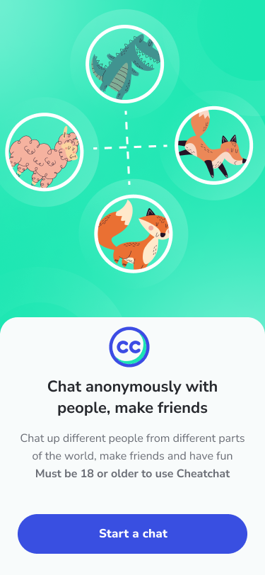
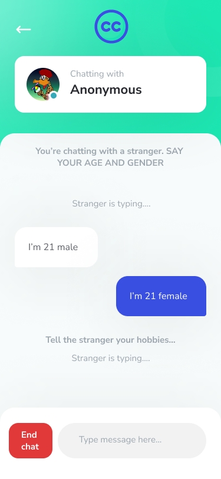

# CheatChat


CheatChat is a Flutter-based mobile application that allows users to chat anonymously with random people from around the world. Make friends, have fun, and connect with others in a safe and engaging environment.

## Features

- **Anonymous Chat**: Chat with random people without revealing your identity.
- **Global Connections**: Meet people from different parts of the world.
- **User-Friendly Interface**: Simple and intuitive design for seamless interaction.
- **Age Restriction**: Must be 18 or older to use the app.

## User Interface




## Getting Started

### Prerequisites

Ensure you have the following installed on your system:

- [Flutter](https://flutter.dev/docs/get-started/install)
- Dart SDK
- Android Studio or any preferred IDE
- A device or emulator for testing

### Installation

1. Clone the repository:
   ```bash
   git clone https://github.com/OniX9/cheatchat.git
   cd cheatchat
    ```
## Contact
- For any inquiries or feedback, feel free to reach out:
- Email: onisfranklin@gmail.com
- GitHub: OniX9
